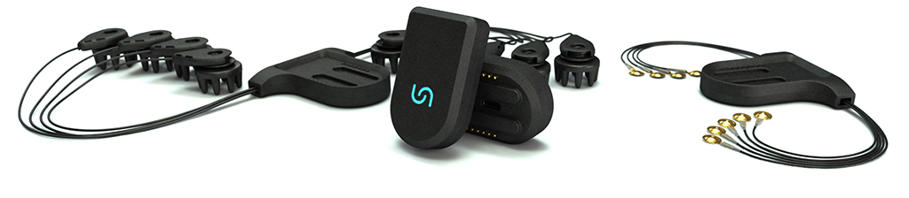
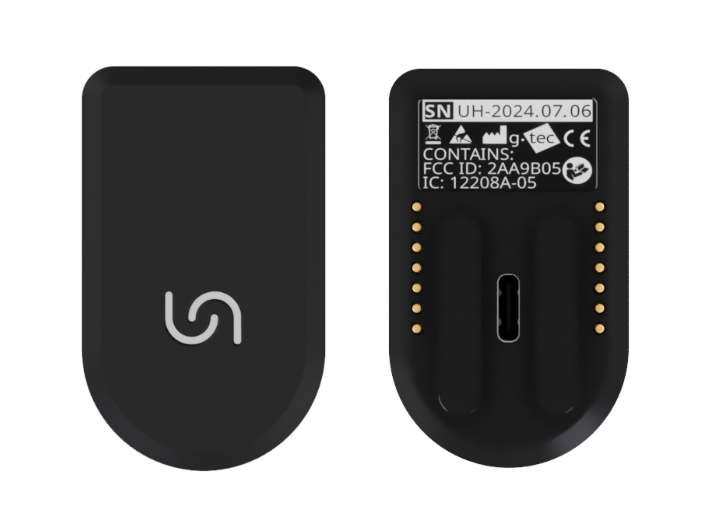
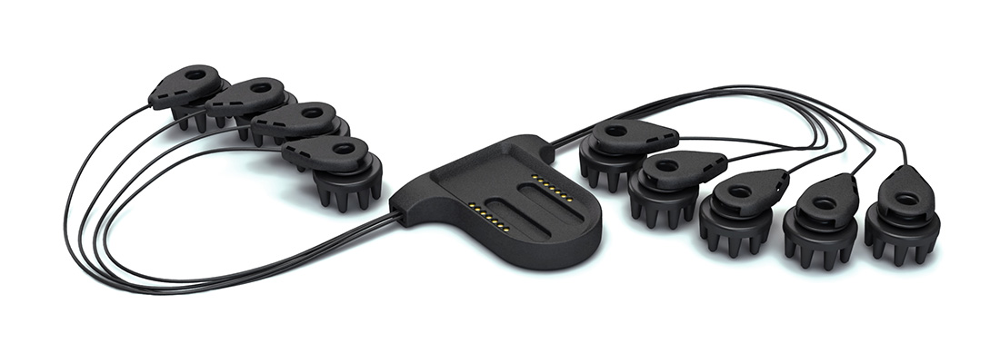
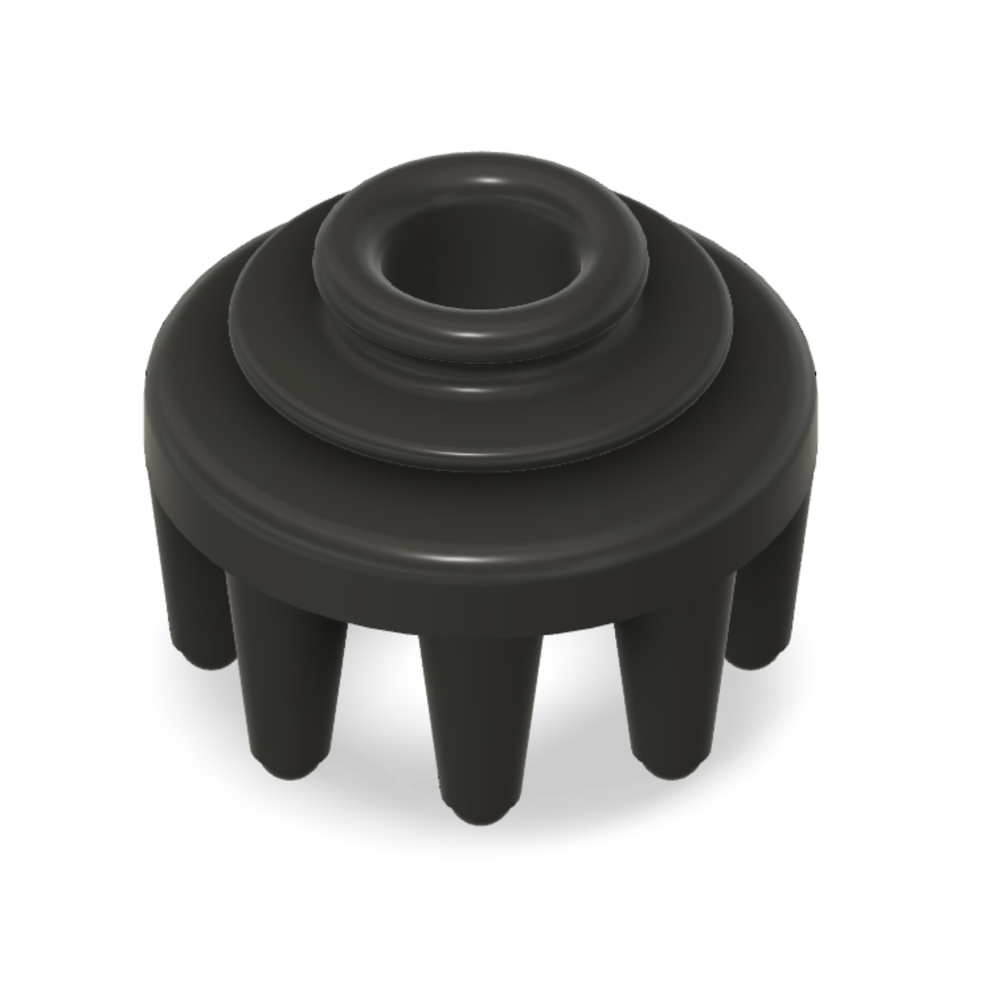
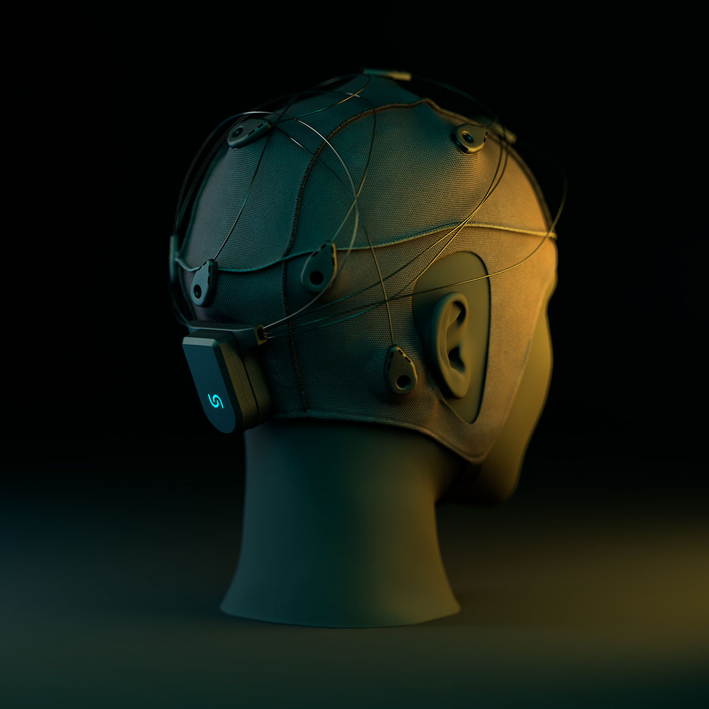
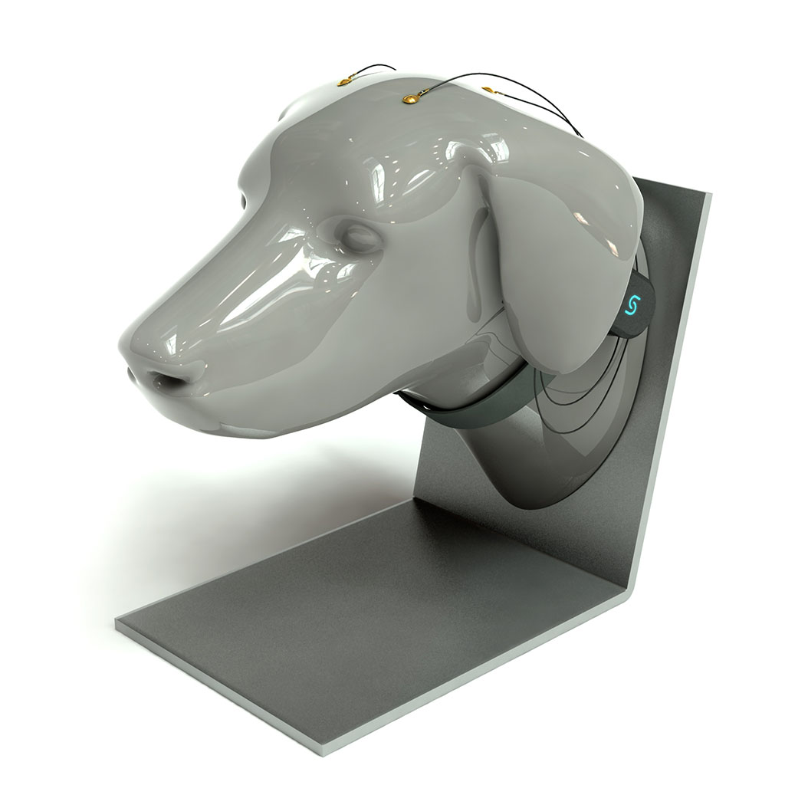
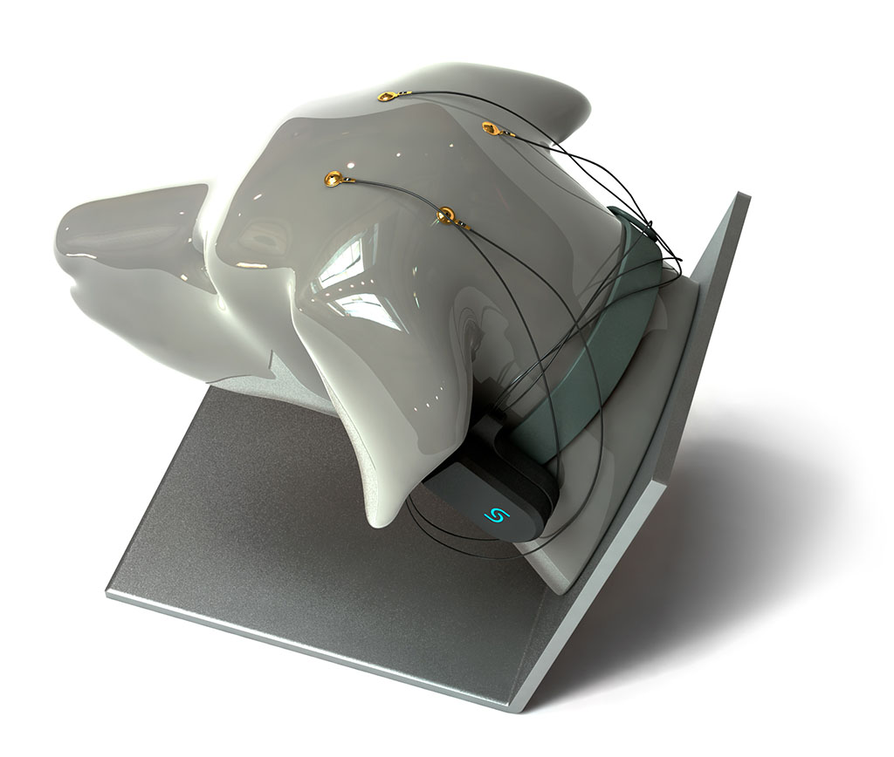
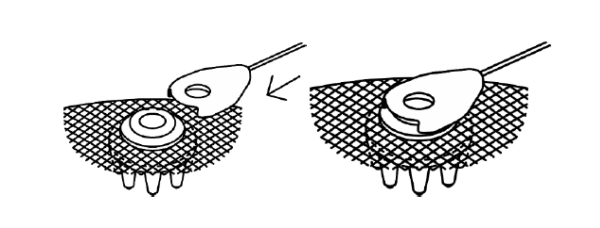
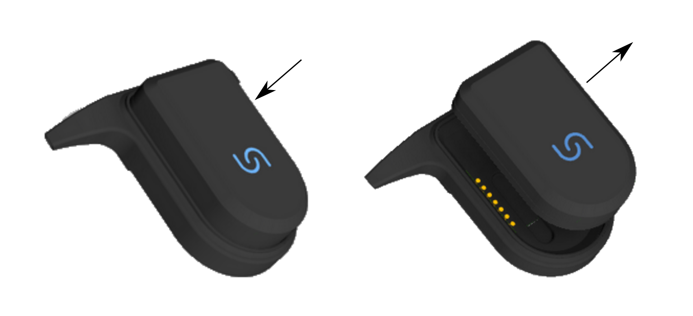
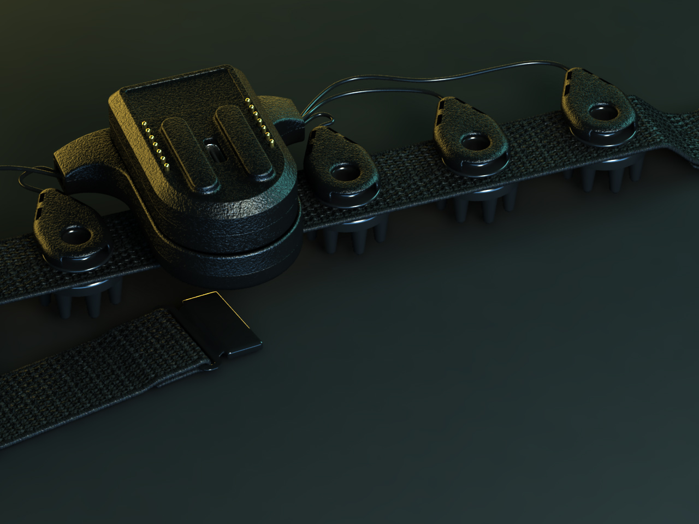

 

 

  <ul style="list-style: none">
    

      <h1> Unicorn BCI Core-8  </h1>
    

  </ul>

[Glossary](#glossary) 
[Safety Notice](#safety-notice) 

[Introduction](#introduction) 
&nbsp;&nbsp;&nbsp;[Highlights](#highlights) 
&nbsp;&nbsp;&nbsp;[Intended Use](#intended-use) 
&nbsp;&nbsp;&nbsp;[Conditions Of Use](#conditions-of-use) 

[Hardware](#hardware) 
&nbsp;&nbsp;&nbsp;[Unicorn BCI Core-8 Amplifier](#unicorn-bci-core-8-amplifier) 
&nbsp;&nbsp;&nbsp;[Unicorn BCI Core-8 Basestation](#unicorn-bci-core-8-basestation) 
&nbsp;&nbsp;&nbsp;[Unicorn BCI Core-8 Electrodes](#unicorn-bci-core-8-electrodes) 
&nbsp;&nbsp;&nbsp;&nbsp;&nbsp;&nbsp;[Unicorn BCI Core-8 Cap](#unicorn-bci-core-8-cap) 
&nbsp;&nbsp;&nbsp;&nbsp;&nbsp;&nbsp;[Unicorn BCI Core-8 Dog Headstrap](#unicorn-bci-core-8-dog-headstrap) 
&nbsp;&nbsp;&nbsp;&nbsp;&nbsp;&nbsp;[Unicorn BCI Core-8 Horse Headstrap](#unicorn-bci-core-8-horse-headstrap) 
&nbsp;&nbsp;&nbsp;[Device handling](#device-handling) 

&nbsp;&nbsp;&nbsp;[Technical Specifications](#technical-specifications) 
&nbsp;&nbsp;&nbsp;[FCC RF Radiation Exposure statement](#fcc-rf-radiation-exposure-statement) 
&nbsp;&nbsp;&nbsp;[Transportation and storage conditions](#transportation-and-storage-conditions) 
&nbsp;&nbsp;&nbsp;[Location details](#location-details) 
&nbsp;&nbsp;&nbsp;[Wast disposal details](#wast-disposal-details) 
&nbsp;&nbsp;&nbsp;[Warranty](#warranty) 

Software 
&nbsp;&nbsp;&nbsp;[Unicorn BCI Core Recorder](https://github.com/unicorn-bi/Unicorn-BCI-Core-Recorder) 
&nbsp;&nbsp;&nbsp;[Unity Bandpower Interface](https://github.com/unicorn-bi/Unicorn-BCI-Core-Unity-Bandpower-Interface) 
  
## Glossary
<table>
    <tr>
        <th>Wording</th>
        <th>Explanation</th>
    </tr>
    <tr>
        <td>Unicorn BCI Core-8 Amplifier</td>
        <td>The amplifier (device) including battery and basestation connector.</td>
    </tr>
    <tr>
        <td>Unicorn BCI Core-8 Basestation</td>
        <td>The amplifier basestation and electrode connector.</td>
    </tr>
    <tr>
        <td>Unicorn BCI Core-8 Electrodes</td>
        <td>The Hybrid EEG electrodes</td>
    </tr>
</table>

## Safety Notice
In order to use this product safely and fully understand all its functions, read this manual before using the product. Follow the instructions for use for the used PC and the connected devices for allowed environmental conditions. The used PC must not go to sleep, hibernate, turn off, or turn on the screensaver during a measurement.

**Warning:** 
Conductible parts of all Unicorn BCI Core-8 Electrodes must not have contact with the earth or other conductible parts.

**Warning:** 
Avoid electrostatic discharge impulses when handling the device or touching the Unicorn BCI Core-8 Electrodes.

**Warning:** 
Electrostatic discharge (ESD) events can harm electronic components inside your Unicorn BCI Core-8. Under certain conditions, electric charge may build up on your body or an object, such as a peripheral, and then discharge into another object, such as your Unicorn BCI Core-8. To prevent ESD damage, you should discharge static electricity from your body before you interact with any of your devices. You can protect against ESD and discharge static electricity from your body by touching a metal grounded object.

**Warning:** 
Pay attention to the precautions regarding electromagnetic compatibility.

**Warning:** 
The operation of the device can be compromised within shielded rooms. In case of problems, relocate the receiving device or consult technical support.

**Warning:** 
The operator must be familiar with the operation of the device and must operate the device according to the instructions for use.

**Warning:** 
The device and its accessories must not be exposed to increased mechanical stress.

**Warning:** 
Each time you use the device, you must first check the device and its accessories for possible damage to connectors, sockets and cables. Check the Unicorn BCI Core-8 electrode cable connections with special care and ensure that the electrode cables have no breaks or cracks. Any cables, connectors, accessories, or other parts of the equipment must be replaced immediately if damaged or not working correctly.

**Warning:** 
The Unicorn BCI Core-8 is not protected against electrical defibrillation - before defibrillation, the Unicorn BCI Core-8 Electrodes must be removed from the subject!

**Warning:** 
Only use accessories identified for use with this device.

**Warning:** 
The device is powered internally via a lithium-polymer accumulator. The accumulator must only be replaced by the manufacturer.

**Note:** 
The Unicorn BCI Core-8 uses special lightweight, thin and highly flexible cables for the Unicorn BCI Core-8 Electrodes to provide high comfort and easy cap mounting, especially for multi-channel recording. These cables are sensitive and need to be treated with special care. Following some basic guidelines will prolong the lifetime of Unicorn BCI Core-8 Electrodes:
    - Never pull on Unicorn BCI Core-8 Electrodes cables.
    - Avoid knots in cables.
    - Do not soak cables and Unicorn BCI Core-8 Electrodes for more than 30 minutes.
    - Avoid exposure to direct sunlight or chemical agents.
    - Make sure that no gel remains on Unicorn BCI Core-8 Electrodes or cables after cleaning.
    - Protect the amplifier unit from contamination with gel, water or disinfectant.
    - Always make sure that Unicorn BCI Core-8 Electrodes, cables and Unicorn BCI Core-8 Bands are completely dry before storing.
    - Don’t cut, kink or pinch electrode cables; light bending is safe.

**Note:** 
Unicorn BCI Core-8 Electrode and cable lifetime depends on proper usage, careful treatment and cleaning, and appropriate storage. The manufacturer will provide warranty replacement only if there is no visible physical damage to the parts, such as: damaged, broken or pinched cables; or damaged housings or connectors.
   
**Warning:** 
- Do not use any detergent other than detergents mentioned in this manual!
- Do not perform automated reprocessing in Washer Disinfectors (WD) or Endoscope Washer Disinfectors (EWD)!
- Do not machine-wash!
- Do not use a laundry dryer or other hot air devices!
- Do not put into an ultrasonic bath!
- Do not autoclave Unicorn BCI Core-8 Cap or Unicorn BCI Core-8 Electrodes!

**Note:** 
The manufacturer is responsible for the safety, performance and reliability of the Unicorn BCI Core-8 as supplied to the customer at the time of delivery. This responsibility expires if the Unicorn BCI Core-8 is changed. Please note the following:
    - Changes to the Unicorn BCI Core-8 must be performed by the manufacturer only, and service and repair must be performed by corresponding qualified personnel only.
    - The Unicorn BCI Core-8 must be used according to the instructions for use.

**Note:** 
The Unicorn BCI Core-8 and its components have been tested and comply with the electromagnetic compliance limits for the Directive 2014/53/EU (radio equipment directive, RED). See the chapter on Electromagnetic compatibility. The equipment, if not installed and used in accordance with the instructions, may cause interference with other devices in the vicinity. If this equipment does interfere with other devices, which can be determined by turning the equipment off and on, try to correct the interference through one or more of the following measures:
    - Reorient or relocate the receiving device.
    - Increase the separation between the equipment.
    - Consult Unicorn technical support.

**Warning:** 
The Unicorn BCI Core-8 must not be used in dangerous conditions such as wet rooms or explosive environments. The relative humidity must be between 25 % and 80 %. 

**Warning:** 
The Unicorn BCI Core-8 must not be used in combination with any other high-frequency device. Using a high frequency device with the Unicorn BCI Core-8 can cause burning under the Unicorn BCI Core-8 Electrodes and could damage the Unicorn BCI Core-8.

**Warning:** 
The Unicorn BCI Core-8 must not be used in humans with pace-makers or electrical stimulators.

**Note:** 
The Unicorn BCI Core-8 uses the 2.4 GHz band for wireless transmission. Ensure that enough transmission bandwidth is available in your environment, since other devices might also use the same band (e.g. WiFi or other Bluetooth devices).

## Introduction
The Unicorn BCI Core-8 is a consumer grade biosignal amplifier kit. It allows developers, artists and makers to integrate signals from the human body within their projects – ranging from simple display of the signals to designing and controlling attached devices and interacting with artistic installations, toys, computer programs or apps and more. The Unicorn BCI Core-8 acquires the EEG from multiple Hybrid EEG Electrodes.

### Highlights
- EEG recordings without cable connection via radio signal
- Bluetooth 5
- Hybrid electrodes for wet and dry measurements
- 8 DC-coupled analog input channels with 24 Bit resolution
- sampling rate of 250 Hz per channel
- oversampling to achieve a high signal-to-noise ratio
- input sensitivity of ± 150 mV

### Intended use
The Unicorn BCI Core-8 is intended for use in non-medical environment for non-medical applications. The Unicorn BCI Core-8 is used by developers, artists, makers and gamers in the user’s environment.

### Conditions of use
#### Operation and storage
Temperature: +5 to +40 °C 
Relative humidity: 25 to 80 %, non-condensing 
Atmospheric pressure: 700 to 1060 hPa 
Altitude: 2000m or less 

## Hardware

The Unicorn BCI Core-8 System consists of the Unicorn BCI Core-8 Amplifier, Unicorn BCI Core-8 Basestation, Unicorn BCI Core-8 Cap and Unicorn BCI Core-8 Electrodes.

 

## Unicorn BCI Core-8 Amplifier

The Unicorn BCI Core-8 Amplifier is the data acquisition unit. It acquires data with 24 bit resolution for an amplitude range of ±150 mV from 8 EEG Channels and transmits data via BLuetooth 5. 

 

### Symbols

<table>
    <tr>
        <th>Symbol</th>
        <th>Description</th>
    </tr>
    <tr>
        <td></td>
        <td>CE mark</td>
    </tr>
    <tr>
        <td></td>
        <td>Do not dispose with domestic waste. Dispose of it via the separate collection system for electrical and electronic equipment.</td>
    </tr>
    <tr>
        <td></td>
        <td>Avoid electrostatic discharge</td>
    </tr>
    <tr>
        <td></td>
        <td>Follow instructions for use</td>
    </tr>
    <tr>
        <td></td>
        <td>Manufacturer g.tec medical engineering GmbH https://www.gtec.at Sierningstrasse 14  4521 Schiedlberg, Austria </td>
    </tr>
    <tr>
        <td></td>
        <td>Serial number in the format: UN-YearOfProduction.Month.Number</td>
    </tr>
    <tr>
        <td></td>
        <td>Contains FCC ID: 2AA9B05</td>
    </tr>
    <tr>
        <td></td>
        <td>Contains IC: 12208A-05</td>
    </tr>
</table>

## Unicorn BCI Core-8 Basestation

The Unicorn BCI Core-8 Basestation is connecting the Unicorn BCI Core-8 Amplifier to the Unicorn BCI Core-8 Electrodes. It is also used to turn the device on and off.

 

The Unicorn BCI Core-8 features 9 electrodes to measure 8 channels EXG.

<table>
    <tr>
        <th>Name</th>
        <th>Description</th>
    </tr>
    <tr>
        <td>1</td>
        <td>Channel 1</td>
    </tr>
    <tr>
        <td>2</td>
        <td>Channel 2</td>
    </tr>
    <tr>
        <td>3</td>
        <td>Channel 3</td>
    </tr>
    <tr>
        <td>4</td>
        <td>Channel 4</td>
    </tr>
    <tr>
        <td>5</td>
        <td>Channel 5</td>
    </tr>
    <tr>
        <td>6</td>
        <td>Channel 6</td>
    </tr>
    <tr>
        <td>7</td>
        <td>Channel 7</td>
    </tr>
    <tr>
        <td>8</td>
        <td>Channel 8</td>
    </tr>
    <tr>
        <td>R</td>
        <td>Reference channel</td>
    </tr>
</table>

## Unicorn BCI Core-8 Electrodes

The Unicorn BCI Core-8 EEG Electrodes are made of a conductive rubber that allow their operation as dry or wet Electrodes.

 

### Unicorn BCI Core-8 Cap

The Unicorn BCI Core-8 Cap is a fabric EEG cap holding the Unicorn BCI Core-8 Electrodes to be able to measure clean EEG.

 

### Unicorn BCI Core-8 Dog Headstrap

The Unicorn BCI Core-8 Dog Headstrap is a fabric holding the Unicorn BCI Core-8 for dogs.

 

 

### Unicorn BCI Core-8 Horse Headstrap

The Unicorn BCI Core-8 Dog Headstrap is a fabric holding the Unicorn BCI Core-8 for horses.

 

## Device handling

### Status LED

The Status LED represents the device status. The following table shows available device states.

<table>
    <tr>
        <th>LED Status</th>
        <th>Description</th>
    </tr>
    <tr>
        <td>Continously on USB attached</td>
        <td>The device is charging.</td>
    </tr>
    <tr>
        <td>Continously off USB attached</td>
        <td>The device is fully charged.</td>
    </tr>
    <tr>
        <td>Fading</td>
        <td>Device is discoverable mode.</td>
    </tr>
    <tr>
        <td>Short blinks</td>
        <td>Device is connected to a device.</td>
    </tr>
    <tr>
        <td>Continously on </td>
        <td>Device is acquisition mode</td>
    </tr>
</table>

### Assembling / Disassembling

The following section describes how to assemble or disassemble the Unicorn.

#### Insert / Remove Unicorn BCI Core-8 Electrodes

The Unicorn BCI Core-8 Band features nine holes for holding nine Unicorn BCI Core-8 EEG Electrodes. The first groove of the electrode is used to attach the electrode connector clip. The second groove is provided to insert and hold the electrode within a Unicorn cap. Stretch one of the predefined electrode holes of the Unicorn BCI Core-8 Band and insert the electrode until the second groove of the electrode is surrounded by fabric. Insert all nine Unicorn BCI Core-8 Electrodes into the predefined positions of the Unicorn cap.

 

#### Connect / Disconnect Unicorn BCI Core-8 Electrodes

To connect or disconnect the clip connector to/from the Unicorn BCI Core-8 Electrode, just slide the clip connector on or off. Make sure that the clip surrounds the first groove of the electrode and that the holes of the electrode and electrode clip overlap.

 

### Turn the device on and off

You have to dock the Unicorn BCI Core-8 Amplifier on the Unicorn BCI Core-8 Basestation to turn the device on. The magnetic connector should hold the device on the Unicorn BCI Core-8 Basestation. The satus LED should turn on and show the current device state.

You have to remove the Unicorn BCI Core-8 Amplifier from the Unicorn BCI Core-8 Basestation to turn the device off.

 

**Note:** 
Charge the the device if the status LED doesn't start fading when placed on the Unicorn BCI Core-8 Basestation.

### Transportation

Remove the Unicorn BCI Core-8 Amplifier from the Unicorn BCI Core-8 Basestation to turn the device off. Put the device onto the Unicorn BCI Core-8 Basestation so you can see the USB connector and the gold pins. The magnetic connector should hold the device on the Unicorn BCI Core-8 Basestation.

 

### Charging the device

Lift the Unicorn BCI Core-8 Amplifier from the Unicorn BCI Core-8 Basestation in order to be able to access the USB connector. Insert the Unicorn USB Charging Cable to charge the device. The status LED will be turned on continously until the device is fully charged. The Status LED will be turned off if the device is fully charged.

**Note:** 
The Unicorn BCI Core-8 has a built-in Lithium-Polymer accumulator. The accumulator may be partly discharged when the system is delivered.

**Note:** 
As long as the USB port of the Unicorn Brain Interface is connected to a working USB port of a PC, Notebook or appropriate wall adapter, the Unicorn Brain Interface can’t be turned on.

**Note:** 
Charging an empty Unicorn battery will take about 3 hours.

**Warning:** 
Do not over-discharge the Unicorn BCI Core-8 battery. Over-discharging can damage the Unicorn BCI Core-8 battery or reduce the performance and life-time.

**Warning:** 
The Unicorn BCI Core-8 cell/battery would be at an over-discharged state by its self-discharge characteristics if the cell is not used for long time. Over long storage periods, batteries should be cycled every 90 days.

**Warning:** 
Store in a 50 % charged state. Do not store at fully charged state (4.2V) for a long period of time.

**Warning:** 
Expected Unicorn BCI Core-8 battery life cycle: The capacity after 500 cycles is expected to be equal to or more than 80 % of the rated capacity. 

**Warning:** 
Operating Temperature
- Charging: 0 °C to 45 °C
- Discharging: -20 °C to 60 °C

**Warning:** 
Storage Temperature
- 1 year at -20 °C to 30 °C

**Warning:** 
Electrical Specifications for charging
- Voltage nominal input: 5 V DC
- Voltage input min/max: 3.75 V - 6 V
- Power input: 5 W

### Technical Specifications

<table>
    <tr>
        <th>General</th>
        <th></th>
    </tr>
    <tr>
        <td>Model</td>
        <td>Unicorn BCI Core-8</td>
    </tr>
    <tr>
        <td>Type</td>
        <td>8-channel amplifier</td>
    </tr>
    <tr>
        <td>LiPo  Battery</td>
        <td> LP702020, 230 mAh (IEC 62133 & RoHS-Compliant)</td>
    </tr>
    <tr>
        <td>Rated power consumption</td>
        <td>134 mW</td>
    </tr>
    <tr>
        <td>Rated DC voltage</td>
        <td>3.7 V</td>
    </tr>
    <tr>
        <td>Manufacturer</td>
        <td>g.tec medical engineering GmbH Sierningstrasse 14  4521 Schiedlberg, Austria</td>
    </tr>
</table>

**Warning:** 
Do not short circuit the battery.   Do not expose cells or batteries to heat or fire. 

<table>
    <tr>
        <th>Analog-Digital-Converter (ADC)</th>
        <th></th>
    </tr>
    <tr>
        <td>Resolution</td>
        <td>24 Bit</td>
    </tr>
    <tr>
        <td>Sampling frequency</td>
        <td>250 Hz</td>
    </tr>
    <tr>
        <td>Number of ADCs</td>
        <td>8</td>
    </tr>
</table>

<table>
    <tr>
        <th>Analog Frontend</th>
        <th></th>
    </tr>
    <tr>
        <td>Channels</td>
        <td>1 to 8 and GND/REF channel</td>
    </tr>
    <tr>
        <td>Sensitivity</td>
        <td>±150 mV</td>
    </tr>
    <tr>
        <td>Highpass</td>
        <td>0 Hz</td>
    </tr>
        <tr>
        <td>Lowpass</td>
        <td>15.92 kHz</td>
    </tr>
    <tr>
        <td>Input impedance</td>
        <td>>100 M&#937;</td>
    </tr>
</table>

<table>
    <tr>
        <th>RF module</th>
        <th></th>
    </tr>
    <tr>
        <td>Operating Frequency range</td>
        <td>2.360 GHz to 2.500 GHz</td>
    </tr>
    <tr>
        <td>Transmit power Max</td>
        <td>+4 dBm</td>
    </tr>
    <tr>
        <td>Receiver sensitivity</td>
        <td>-96 dBm</td>
    </tr>
    <tr>
        <td>Compliance</td>
        <td>Bluetooth 5</td>
    </tr>
        <tr>
        <td>Marking</td>
        <td>CE, FCC, IC, MIC, RCM, ANATEL, EAC, IFETEL, SRRC, KCC</td>
    </tr>
        <tr>
        <td>FCC ID</td>
        <td>2AA9B05</td>
    </tr>
        <tr>
        <td>IC</td>
        <td>12208A-05</td>
    </tr>
        <tr>
        <td>MIC</td>
        <td>210-108944</td>
    </tr>
    </tr>
        <tr>
        <td>ANATEL</td>
        <td>00857-21-05903</td>
    </tr>
    </tr>
        <tr>
        <td>IFTEL</td>
        <td>RCPRIBM18-1491</td>
    </tr>
    </tr>
        <tr>
        <td>SRRC</td>
        <td>2018DJ7255</td>
    </tr>
    </tr>
        <tr>
        <td>KCC</td>
        <td>R-C-Rgd-BMD-350</td>
    </tr>
</table>

The Unicorn BCI Core-8 complies with Part 15 of the FCC Rules. Operation is subject to the following two conditions: (1) this Unicorn BCI Core-8 may not cause harmful interference, and (2) this Unicorn BCI Core-8 must accept any interference received, including interference that may cause undesired operation.

### FCC RF Radiation Exposure statement
This Unicorn BCI Core-8 complies with Industry Canada license-exempt RSS standard(s). Operation is subject to the following two conditions: (1) this Unicorn BCI Core-8 may not cause interference, and (2) this Unicorn BCI Core-8 must accept any interference, including interference that may cause undesired operation of the Unicorn BCI Core-8.

Under Industry Canada regulations, this radio transmitter may only operate using an antenna of a type and maximum (or lesser) gain approved for the transmitter by Industry Canada. To reduce potential radio interference to other users, the antenna type and its gain should be chosen so that the equivalent isotropically radiated power (e.i.r.p.) is not more than that necessary for successful communication.

**Note:** 
The Unicorn BCI Core-8 uses the 2.4 GHz band for wireless transmission. Ensure that enough transmission bandwidth is available in your environment, since other devices might also use the same band (e.g. WiFi or other Bluetooth devices). Use wireless screening tools to ensure the availability of the necessary transmission channel.

## Transportation and storage conditions
The Unicorn Brain Interface can be stored at temperatures between –20° to +45° Celsius. The relative humidity must be between 25 % and 80 %. If there is any condensed water, wait until it disappears before use (wait at least 1 h in a heated room).

## Location details
Do not use the Unicorn Brain Interface near a heating system or directly in the sun. During operation, the outside temperature should be between +5° Celsius and +35° Celsius and the air pressure between 700 and 1060 hPa.

## Waste disposal details
Bring the Unicorn Brain Interface to a recycling center or sent it back to the manufacturer.

## Warranty
Warranty in the EU is 6 month and 30 days in other countries for the Unicorn Brain Interface. The Unicorn BCI Core-8 Electrodes, the Unicorn Gel and the disposable Unicorn Sticky Electrodes are consumables. Only use parts from g.tec to operate the Unicorn Brain Interface. Warranty is invalidated if anyone except a g.tec employee opens or disassembles any components of the Unicorn. Warranty only applies for properly used devices. Please note that any damage resulting from improper treatment of the system will not be covered by the warranty. This may include broken, kinked or damaged wires and cables, damaged isolators and enclosures

### Electromagnetic compatibility (EMC)
The EMC declaration is available on request.

### Declaration of Conformity
The declaration of conformity is available on request.
 
 
 
 

Instructions for use - Unicorn BCI Core-8 Version Number 1.24.00
  
<td>g.tec medical engineering GmbH Sierningstrasse 14  4521 Schiedlberg, Austria</td>
 
<a href="https://www.gtec.at">https://www.gtec.at</a> |
<a href="mailto:support@gtec.at">support@gtec.at</a>
   Copyright &#169; 2024 g.tec medical engineering GmbH Austria

